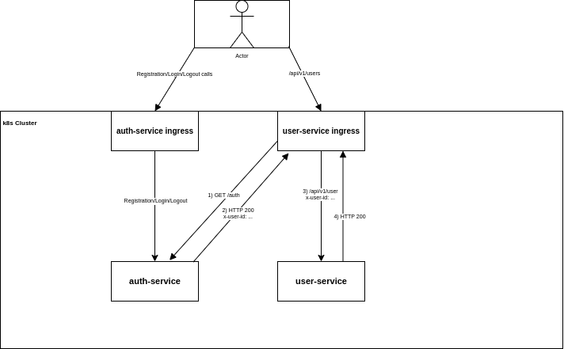
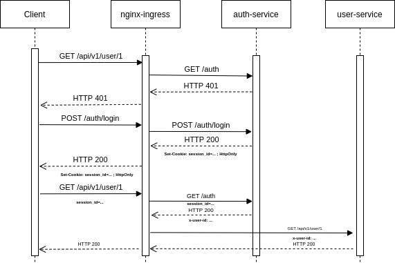

# otus-user-service
User API


### Схемы работы





### Директория с чартами сервисов

`infra/`

### Установка

Установка user-service
```
kubectl create ns user-service
helm upgrade --install -n user-service -f infra/user-service/values.yaml user-service infra/user-service/.
```

Установка auth-service
```
kubectl create ns auth-service
helm upgrade --install -n auth-service -f infra/auth-service/values.yaml auth-service infra/auth-service/.
```

Установка api-gateway
```
kubectl apply -f infra/api-gateway/ingress.yaml
```

### Удаление

```
helm uninstall user-service -n user-service
helm uninstall auth-service -n auth-service
```

### Тестирование

```
newman run --verbose integration_tests/user_api_auth.json
```