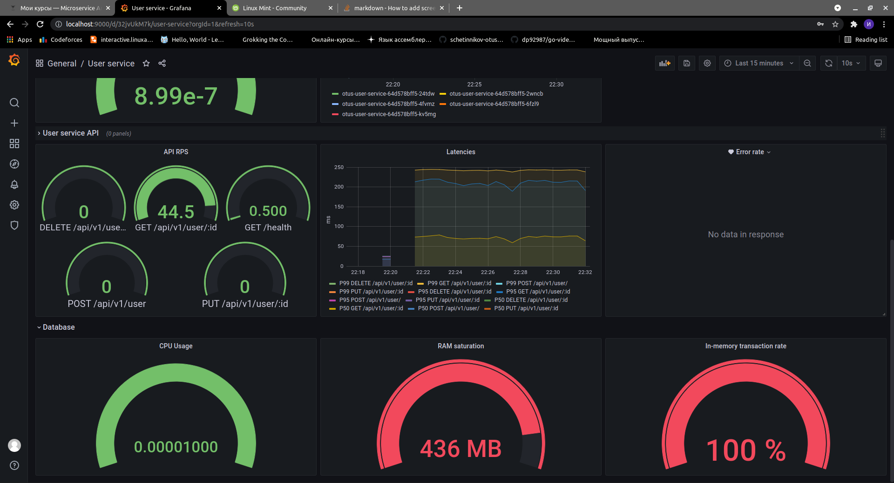

# otus-user-service
User API

### Директория с чартом сервиса

`infra/user-service`

### Дашборд

Проброс порта к Grafana

`kubectl port-forward -n monitoring svc/prometheus-grafana 9000:80`

После этого Grafana будет доступна на `localhost:9000`.

Логин/Пароль для доступа `admin/prom-operator`

`./dashboard/dashboard.json`

### Установка

Одной командой

    make install

Или последовательно

    kubectl create ns monitoring
    helm repo add prometheus-community https://prometheus-community.github.io/helm-charts
    helm upgrade --install -n monitoring -f infra/prometheus/prometheus.yaml prometheus prometheus-community/kube-prometheus-stack --atomic
    helm repo add ingress-nginx https://kubernetes.github.io/ingress-nginx
    helm upgrade --install -f infra/prometheus/nginx-ingress.yaml nginx ingress-nginx/ingress-nginx --atomic
    kubectl create ns user-service
    helm upgrade --install -n user-service -f infra/user-service/values.yaml user-service infra/user-service/.

### Удаление

Одной командой

    make uninstall

Или последовательно

    helm uninstall user-service -n user-service
    helm uninstall nginx
    helm uninstall prometheus -n monitoring
    kubectl delete ns monitoring
    kubectl delete ns user-service

### Тестирование

`newman run integration_tests/user_api_collection.json`

### Скриншот после стресс тестирования

