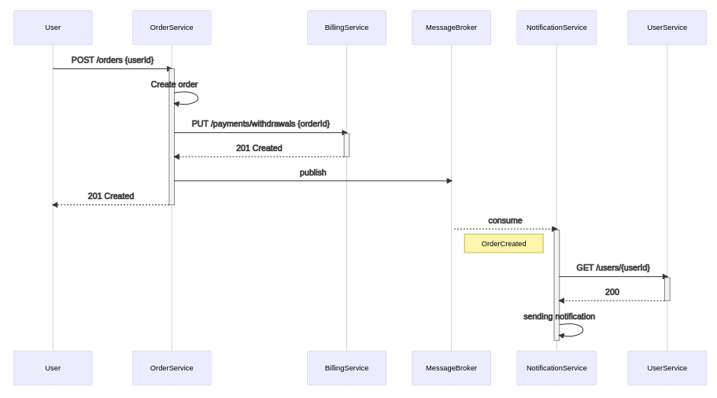

# otus-user-service
User API

## Restful 

[Описание REST интерфейсов](http://petstore.swagger.io/?url=https://raw.githubusercontent.com/ivahotin/otus-user-service/main/specs/restful/rest-openapi.yaml)


## Event notification

[Описание ASYNC интерфейса](./specs/eventsnotification/asyncapi.yaml)

[Описание REST интерфейсов](http://petstore.swagger.io/?url=https://raw.githubusercontent.com/ivahotin/otus-user-service/main/specs/eventsnotification/rest-openapi_v2.yaml)


## Event collaboration

[Описание ASYNC интерфейса](./specs/eventcollaboration/asyncapi.yaml)

В отличие от **Event notification** тело событий содержит всю необходимую для обработки информацию. `NotificationService` хранит свою локальную копию данных о профилях пользователей, которая обновляется благодаря событиям типа `UserUpdated`


## Предпочтительный вариант

[Описание REST интерфейса](http://petstore.swagger.io/?url=https://raw.githubusercontent.com/ivahotin/otus-user-service/main/specs/preferable/rest-openapi.yaml)

[Описание ASYNC интерфейса](./specs/preferable/asyncapi.yaml)

По своей природе взаимодействие `OrderService` и `BillingService` синхронное, потому что мы не можем судить об успешности создания заказа пока не удостоверились в том, что его можно оплатить. Данное взаимодействие может быть асинхронным, если речь идет о несрочных заказах. В этом случае пользователь может быть уведомлен, что заказ создан и находится в обработке. Однако если речь идет о заказе еды или такси, то врядли пользователь пожелает ждать неопределенное количество времени до подтверждения своего заказа. В свою очередь взаимодействие с `NotificationService` асинхронно, так как мы не беспокоимся о результате его выполнения. По мимо этого я считаю, что выполнить запрос к `UserService` проще чем поддерживать локальную копию данных в `NotificationService`.



## Директория с чартами сервисов

`infra/`

## Установка

Установка user-service
```
kubectl create ns user-service
helm upgrade --install -n user-service -f infra/user-service/values.yaml user-service infra/user-service/.
```

Установка auth-service
```
kubectl create ns auth-service
helm upgrade --install -n auth-service -f infra/auth-service/values.yaml auth-service infra/auth-service/.
```

Установка billing-service
```
kubectl create ns billing-service
helm upgrade --install -n billing-service -f infra/billing-service/values.yaml billing-service infra/billing-service/.
```

Установка kafka
```
kubectl create ns kafka
kubectl apply -f infra/kafka/spec.yaml -n kafka
helm upgrade --install -n kafka cp confluentinc/cp-helm-charts -f infra/kafka/cp_values.yaml
kubectl apply -f infra/kafka/debezium_connector.yaml -n kafka
curl -X POST http://192.168.49.2:30500/connectors -H 'Content-Type: application/json' -d @infra/kafka/connectors/user-profile-connector.json
curl -X POST http://192.168.49.2:30500/connectors -H 'Content-Type: application/json' -d @infra/kafka/connectors/billing-db-profile.json
```

Установка api-gateway
```
kubectl apply -f infra/api-gateway/ingress.yaml
```

## Удаление

```
helm uninstall user-service -n user-service
helm uninstall auth-service -n auth-service
```

## Тестирование

```
newman run --verbose integration_tests/user_api_auth.json
```