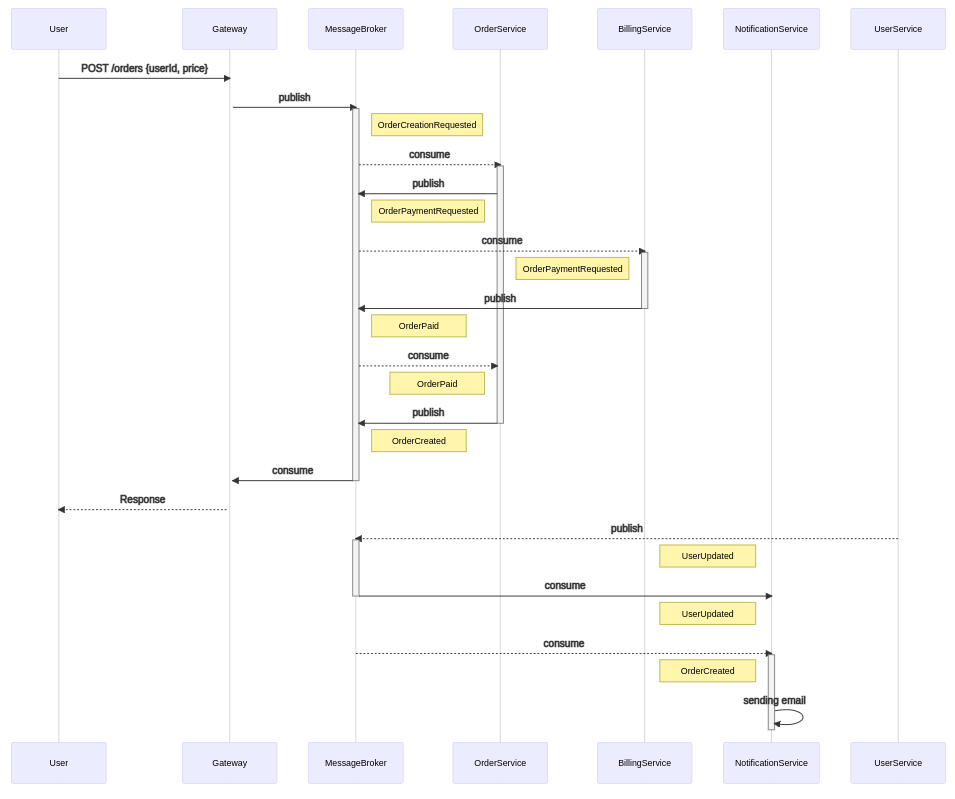

## Идемпотентность API


#### Идемпотентность order-service

Для достижения идемпотентности в `order-service` используется версионирование списка заказов. Это реализовано следующим образом:

1) В таблицу с заказами добавлена колонка `version`
```
create table if not exists orders (
    id uuid primary key,
    owner_id uuid not null,
    price integer not null,
    version integer not null,
    status varchar(20) not null
);

create unique index concurrently if not exists owner_id_version_idx on orders (owner_id, version);
```
2) При создании заказа в запросе передается заголовок `If-Match: <версия списка>`. В случае если в запросе передается последняя версия, то заказ успешно создается с новой версией (+1 к версии переданной в заголовке `If-Match`). В противном случае возвращается ответ со статусом `409 Conflict` и заголовком `ETag: <последняя версия заказа>`.

Недостатком этого подхода является необходимость проверки последней версии списка заказов перед операцией вставки в таблицу `orders`.

```
select max(version) from orders where owner_id = ?;
```

#### Идемпотентность billing-service

`billing-service` принимает запросы с заголовком `Idempotency-Key`. Внутри себя `billing-service` поддерживает две таблицы:

```
create table if not exists billing_accounts (
    owner_id uuid primary key,
    amount integer not null default 0
);
create table if not exists transactions (
    id serial primary key,
    idempotency_key uuid not null,
    created_at timestamp without time zone not null,
    amount integer not null,
    is_cancelled boolean not null default false
);
create unique index concurrently if not exists idempotency_key_idx on transactions using btree (idempotency_key) where is_cancelled = false;
```

Каждый раз когда необходимо выполнить операцию с платежным аккаунтом атомарно обновляются обе таблицы. Уникальный индекс на поле `idempotency_key` помогает предотвратить двойную оплату (или пополнение). Таким образом таблица `transactions` помогает достичь идемпотентности и выполняет роль аудиторского лога всех операций.

## Restful 

[Описание REST интерфейсов](http://petstore.swagger.io/?url=https://raw.githubusercontent.com/ivahotin/otus-user-service/main/specs/restful/rest-openapi.yaml)


## Event notification

[Описание ASYNC интерфейса](./specs/eventsnotification/asyncapi.yaml)

[Описание REST интерфейсов](http://petstore.swagger.io/?url=https://raw.githubusercontent.com/ivahotin/otus-user-service/main/specs/eventsnotification/rest-openapi_v2.yaml)


## Event collaboration

[Описание ASYNC интерфейса](./specs/eventcollaboration/asyncapi.yaml)

В отличие от **Event notification** тело событий содержит всю необходимую для обработки информацию. `NotificationService` хранит свою локальную копию данных о профилях пользователей, которая обновляется благодаря событиям типа `UserUpdated`



## Предпочтительный вариант

[Описание REST интерфейса](http://petstore.swagger.io/?url=https://raw.githubusercontent.com/ivahotin/otus-user-service/main/specs/preferable/rest-openapi.yaml)

[Описание ASYNC интерфейса](./specs/preferable/asyncapi.yaml)

По своей природе взаимодействие `OrderService` и `BillingService` синхронное, потому что мы не можем судить об успешности создания заказа пока не удостоверились в том, что его можно оплатить. Данное взаимодействие может быть асинхронным, если речь идет о несрочных заказах. В этом случае пользователь может быть уведомлен, что заказ создан и находится в обработке. Однако если речь идет о заказе еды или такси, то врядли пользователь пожелает ждать неопределенное количество времени до подтверждения своего заказа. В свою очередь взаимодействие с `NotificationService` асинхронно, так как мы не беспокоимся о результате его выполнения.


## Директория с чартами сервисов

`infra/`

## Установка

Установка user-service
```
kubectl create ns user-service
helm upgrade --install -n user-service -f infra/user-service/values.yaml user-service infra/user-service/.
```

Установка auth-service
```
kubectl create ns auth-service
helm upgrade --install -n auth-service -f infra/auth-service/values.yaml auth-service infra/auth-service/.
```

Установка billing-service
```
kubectl create ns billing-service
helm upgrade --install -n billing-service -f infra/billing-service/values.yaml billing-service infra/billing-service/.
```

Установка order-service
```
kubectl create ns order-service
helm upgrade --install -n order-service -f infra/order-service/values.yaml order-service infra/order-service/.
```

Установка kafka
```
kubectl create ns kafka
kubectl apply -f infra/kafka/spec.yaml -n kafka
helm upgrade --install -n kafka cp confluentinc/cp-helm-charts -f infra/kafka/cp_values.yaml
// Подождать пока все поды поднимутся ~5-6 минут
watch -n 5 kubectl get pods -n kafka
kubectl apply -f infra/kafka/debezium_connector.yaml -n kafka
curl -X POST http://$(minikube ip):30500/connectors -H 'Content-Type: application/json' -d @infra/kafka/connectors/user-profile-connector.json
curl -X POST http://$(minikube ip):30500/connectors -H 'Content-Type: application/json' -d @infra/kafka/connectors/billing-db-profile.json
```

Установка api-gateway
```
kubectl apply -f infra/api-gateway/ingress.yaml
```

## Удаление

```
helm uninstall user-service -n user-service
helm uninstall auth-service -n auth-service
helm uninstall billing-service -n billing-service
helm uninstall order-service -n order-service
helm uninstall cp -n kafka
```

## Тестирование

```
newman run --verbose integration_tests/user_api_auth.json
```